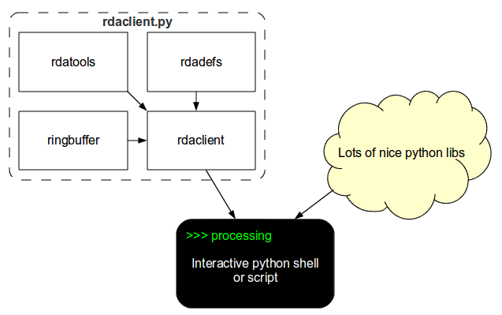
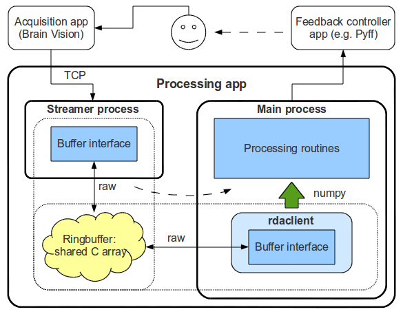

Details
=======

This section gives an overview of the package's internal structure and
some implementation details.  

Overview
--------

rdaclient.py package includes 4 modules:

* :mod:`rdaclient`, a client itself (main module)
* :mod:`ringbuffer`, a circular buffer with homogeneous elements
* :mod:`rdadefs`, RDA API definitions (ctypes)
* :mod:`rdatools`, helper functions

Due to its asynchronous nature, rdaclient.py can be used interactively
in the python shell (see the :doc:`tutorial`) in combination with other 
python libraries and processing routines. Other modules can be used
independently. The dependency diagram is given in **figure 1** 

   
   **Figure 1**. rdaclient.py dependency diagram

Architecture
------------
Two main components of the rdaclient.py are the `Client` and the `Buffer`

The Client
++++++++++

The rdaclient.py basically does three things:

* receives the data from the remote RDA data source
* writes the data to a buffer
* provides an API for asynchronous data reading

The data is being received and buffered by a separate process (:class:`~rdaclient.Streamer`),
which is started and controlled by the :class:`~rdaclient.Client` instance in the
main application code. Both processes access the same memory area through the
buffer interface, provided by the :mod:`ringbuffer` module (see `The Buffer`_ for
implementation details). This architecture is illustrated in **figure 2**
as a part of a BCI (Brain-Computer Interface) loop

   
   **Figure 2**. rdaclient.py's architecture (Processing app)

|

More information on the interprocess data sharing can be found in the documentation
of the python's `multiprocessing <http://docs.python.org/library/multiprocessing.html>`_
package.

The Buffer
++++++++++

:mod:`ringbuffer` is an independent module which was designed to be easily
embeddable in python applications which require a contiguous fixed-size
ring buffer. It has several important features which make it suitable
for the `rdaclient.py`.

**Chunk reading/writing**

One of the design goals was to minimize the number of memory copies while
reading from the buffer. This is important, for example, when one wants to
process the data within a sliding widow and needs to read a large chunk of
the same data every time the window is updated. 

A usual solution in C will be to return a proper pointer to the processing
routine. In python, this is achievable with the help of numpy view objects.
The problem, however, arises when the write pointer reaches the end of the
array (the buffer is full). Since it's a ring buffer, the write pointer is
set to the beginning of the array to overwrite the old data. Any data chunk
that is more than one sample long will now be non-contiguous in memory
(split into tail and head parts). This makes it impossible to create a
numpy view object and the whole data chunk has to be copied before it's
passed to a processing routine. If the length of the data chunk is known
(like in the case of a sliding window reading), it is possible to subdivide
the buffer array into two parts: a working array and a pocket. The way this
approach works around the aforementioned problem is illustrated in
**figure 3**.

.. figure:: images/buffer.png
    :align: center

    **Figure 3**. Buffer writing and reading (b) with and (a) without a pocket.

|

**Data and interface separation**

The buffer consists of a buffer interface (defined by a
:class:`~ringbuffer.RingBuffer` class) and the raw sharectypes byte
array, which contains both data and the metadata, i.e. all the
information about the buffer's state.

Such interface and data separation makes it possible to use the buffer
simultaneously by several processes. The possible algorithm can be:

* A :class:`~ringbuffer.RingBuffer` object is created and initialized in one of 
  the processes.
* newly generated raw array is shared between the child processes.
* those processes create their own :class:`~ringbuffer.RingBuffer` objects
  and initialize them from the raw array
  (:meth:`~ringbuffer.RingBuffer.initialize_from_raw`)provided by the parent,
  so that they all point to the same shared array.

The raw array has the following structure:

1. The header section:
   
   Contains the metadata such as size of the sections, current write
   pointer, datatype, number of channels (number of columns) and total
   number of samples (not bytes) written

2. The buffer section:

   Contains the actual data in the buffer. When the write pointer reaches
   the end of the section it jumps to the beginning overwriting the old
   data. This section is further subdivided into the working and the pocket
   sections (described above).
   
   
Further development
-------------------

There are some basic features left unimplemented:

* marker handling
* support for different data types (e.g. int16 support)

Marker handling can for example be implemented as a static method of the
:class:`rdadefs.rda_msg_data_t` class. Different data types support can be
more demanding, since it'll require several classes and methods to be
re-factored.

The control path between the main process and the Streamer is currently
implemented rather as a workaround and should probably be redesigned.

Finally, overall stability improvements should be considered.
