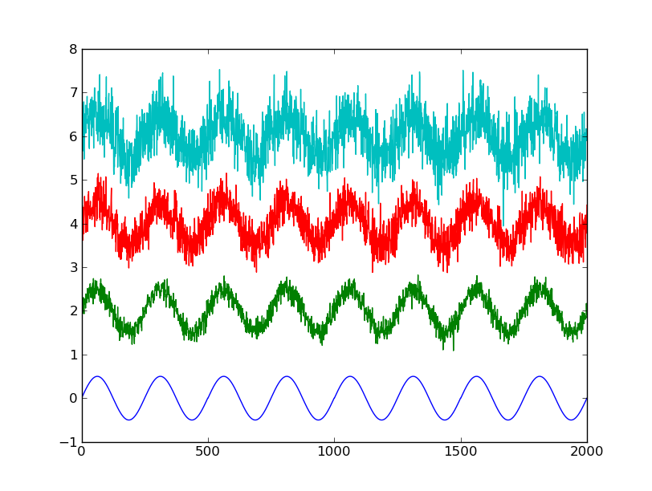

Tutorial
========

In this tutorial we'll use ``rdaclient.py`` from an interactive python shell (e.g. IPyhton) to establish a connection with an RDA server and grab/plot some data. It'll cover only the basic functionality, so the reader it encouraged to skim through the API documentation (it's pretty short) and check out the `Example scripts`_.  

RDA Server setup
----------------
First of all, we need some data-source. If you don't have an EEG recording set-up at hand, there's a local RDA server emulator available in the same dir: ``examples/rdasim.py``. It will start a local TCP server and share a noisy sinusoid to any connected client. In this tutorial we'll use following configuration:

* Sampling Frequency: 500.0 Hz
* Block Size: 500 samples
* Number of Channels: at least 1 :)

If you're using ``rdasim.py``, it'll also be good to set `signal frequency` = 2.0. To start the server with this configuration, type::

    cd examples/
    ./rdasim.py 500 500 2

The server should now be up and waiting for connections. Refer to ``./rdasim.py -h`` for more options.

Working with a client
---------------------
Once you're in the interactive shell, create a client, connect to the server and start data streaming in the background::

    >>> import rdaclient
    >>> client = rdaclient.Client()
    >>> client.start_streaming()
    
If everything went ok, you should see something like::

    [24218:MainThread] rdaclient: INFO: waiting for an rda start message...
    [24218:MainThread] rdaclient: INFO: start message received, 4 channels: 
    1: 1.0 uV
    2: 1.0 uV
    3: 1.0 uV
    4: 1.0 uV

    [24218:MainThread] rdaclient: INFO: initializing buffer...
    [24218:MainThread] rdaclient: INFO: spawning a streamer process...
    [24220:MainThread] data_streamer: INFO: started streaming
    
    >>>

This means that the data is currently being received and written to the buffer. To see how many samples are already in the buffer, type::

    >>> client.get_last_sample()
    
    11500L
    
|
       
You can get an arbitrary chunk of data from the buffer using :meth:`~rdaclient.Client.get_data` method::

    >>> client.get_data(0, 10000)   # gets the data chunk from sample 0 to sample 10000
    
    array([[ 0.05664886,  0.05664886,  0.05664886,  0.05664886],
       [-0.00824889, -0.00824889, -0.00824889, -0.00824889],
       [ 0.00824752,  0.00824752,  0.00824752,  0.00824752],
       ..., 
       [-0.00940873, -0.00940873, -0.00940873, -0.00940873],
       [-0.01339465, -0.01339465, -0.01339465, -0.01339465],
       [ 0.07169104,  0.07169104,  0.07169104,  0.07169104]], dtype=float32)
       
To get the most recent data chunk, one can use :meth:`~rdaclient.Client.poll`. It will block until the next buffer write (or the timeout expired) and return the specified number of samples::

    >>> client.poll(3)   # requests 3 samples. May block for about a second with current configuration
    
    array([[ 0.02012571,  0.02012571,  0.02012571,  0.02012571],
           [ 0.00282201,  0.00282201,  0.00282201,  0.00282201],
           [-0.06295129, -0.06295129, -0.06295129, -0.06295129]], dtype=float32)

.. note::

    If the requested samples are not yet available in the buffer, or have already been overwritten, both :meth:`~rdaclient.Client.get_data`, :meth:`~rdaclient.Client.wait` and :meth:`~rdaclient.Client.poll` will instantaneously return ``None`` 

|

Let's now plot some data:

    >>> import matplotlib.pylab as plt
    >>> data = client.poll(2000)    # gets most recent 2000 samples
    >>> plt.plot(data[:, 0])
    >>> plt.plot(data[:, 1] + 2.)   # add some vertical offset
    >>> plt.plot(data[:, 2] + 4.)
    >>> plt.plot(data[:, 3] + 6.)
    >>> plt.show()

You should now see something like:

   
   2000 samples, 4 channels
   
|

After you're done with recording, it's always a good practice to properly stop the streaming::

    >>> client.stop_streaming()
    >>> client.disconnect()
    
Such an output ensures that the streamer process is joined::

    [25007:MainThread] data_streamer: INFO: stopped streaming
    [25003:MainThread] rdaclient: INFO: stopped streaming

.. note::

    After the streaming is stopped, you can still use :meth:`~rdaclient.Client.get_data` to get some data from the buffer. It is also usually possible to resume streaming by calling :meth:`~rdaclient.Client.start_streaming` again.

Example scripts
---------------

There are currently two example scripts available in the ``examples/`` folder:

* **test_raw.py**: online data plotting
* **test_fft.py**: simple processing and online plotting

Both of them use `gnuplot <http://www.gnuplot.info/>`_ for plotting, because it has a pretty good refresh rate. It is included in some of the popular linux distributions (e.g. Ubuntu), so check if you already have it. The data and commands are transferred to gnuplot through STDIN. There some parameters that can be changed, so check out comments in the source code.

    

    
    
    
